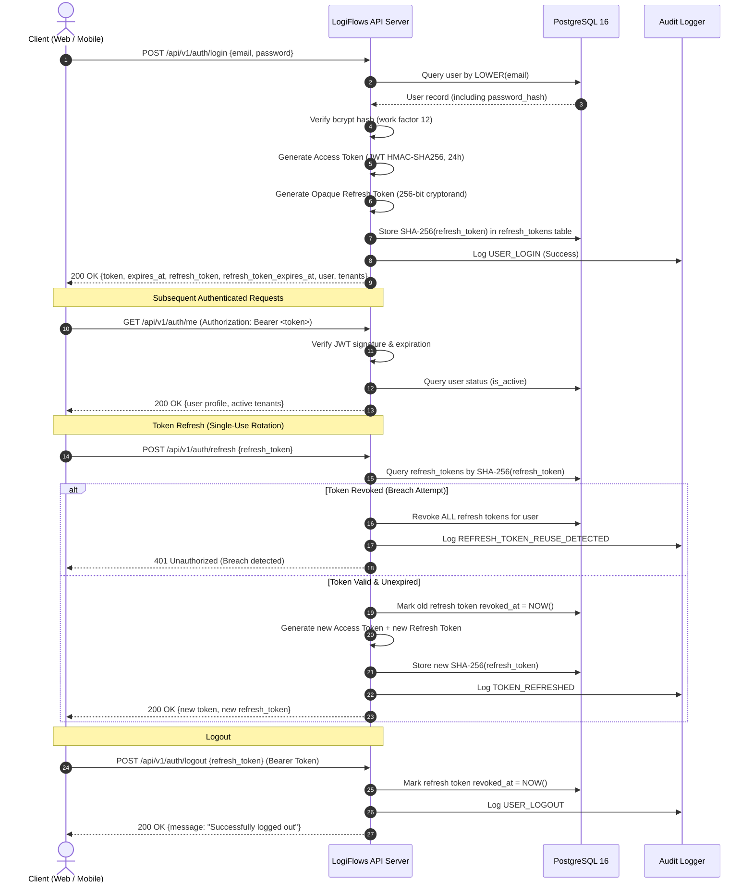

# LogiFlows Architecture: Authentication & Session Strategy

## 1. Overview
The LogiFlows Authentication subsystem provides secure, stateless identity verification across web dashboards, API integrations, and mobile custody applications. It combines short-lived signed JSON Web Tokens (JWT) with long-lived, opaque, cryptographically hashed refresh tokens.

---

## 2. Token Architecture & Dual-Token Strategy



---

## 3. JWT Access Token Specification
- **Algorithm**: `HMAC-SHA256` (`HS256`).
- **Signature Security**: The verification handler enforces `jwt.SigningMethodHMAC` explicitly to defeat algorithm confusion (`none` algorithm or RSA/HMAC substitution attacks).
- **Secret Constraints**: Enforced at server startup; minimum 32 characters (`JWT_SECRET`).
- **Claims Structure**:
  ```json
  {
    "sub": "b2f6b8b0-8f92-4f0e-bb69-52e6d6bb1b01",
    "email": "balamurugan@quickcargo.com",
    "is_platform_admin": false,
    "iss": "logiflows-api",
    "exp": 1790184000,
    "iat": 1789320000
  }
  ```
- **Lifespan**: Configurable via `JWT_ACCESS_EXPIRY` (default `24h`).

---

## 4. Opaque Refresh Token Lifecycle & Breach Detection
1. **Generation**: 32 cryptographically secure random bytes generated via `crypto/rand`, encoded to a 64-character hexadecimal string.
2. **Persistence**: The raw refresh token is returned to the client and never saved in plain text. Only its SHA-256 digest (`VARCHAR(64)`) is stored in `refresh_tokens`.
3. **Single-Use Rotation**: Every successful call to `/api/v1/auth/refresh` immediately revokes the submitted refresh token (`revoked_at = NOW()`) and issues a fresh token pair.
4. **Breach Detection / Token Reuse Prevention**:
   - If an already-revoked refresh token is presented, the system assumes a token compromise (e.g., token theft by a malicious actor).
   - The server immediately triggers `tokenRepo.RevokeAllForUser(ctx, rt.UserID)`, invalidating every active session for that account.
   - A critical security audit event (`REFRESH_TOKEN_REUSE_DETECTED`) is logged with client IP and User-Agent.
   - The request is terminated with `401 Unauthorized`.

---

## 5. Defense-in-Depth Protections
- **Password Security**: Bcrypt with computational cost factor 12. Password complexity requires uppercase, lowercase, digit, and special character.
- **Timing Attack Mitigation**: When login fails due to a non-existent email, a dummy bcrypt comparison is executed against a constant hash to equalize server response time and prevent user enumeration.
- **Zero Secret Leakage**: The domain entity `users.User` defines `PasswordHash string json:"-"` to guarantee that password hashes can never be serialized in JSON responses.
