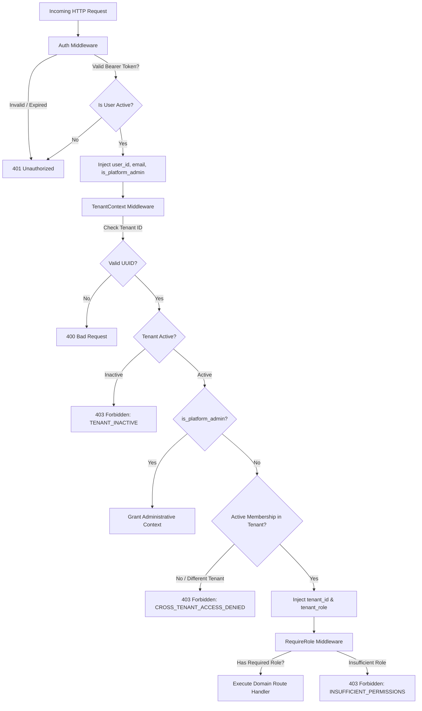

# LogiFlows Architecture: Authorization & Role-Based Access Control (RBAC)

## 1. Overview
LogiFlows implements a strict two-tiered authorization model:
1. **Platform-Level Authorization**: Governs cross-tenant system administration (`is_platform_admin`).
2. **Tenant-Level Authorization**: Governs resources scoped to a specific business organization (`role` in `tenant_memberships`).

---

## 2. Role Hierarchy & Matrix

| Role | Scope | Description |
| :--- | :--- | :--- |
| `PLATFORM_ADMIN` | Global / Multi-Tenant | System administrator with supervisory access across all platform entities and tenants. |
| `TENANT_ADMIN` | Tenant Organization | Executive administrator for a company. Can manage billing, company profile, and invite/manage team members. |
| `TENANT_OPERATOR` | Tenant Organization | Operations manager who creates shipments, assigns drivers, updates routes, and tracks deliveries. |
| `VIEWER` | Tenant Organization | Read-only stakeholder who can inspect shipments, tracking data, and team rosters without modification rights. |

---

## 3. Permission Capabilities Matrix

| Operation | `PLATFORM_ADMIN` | `TENANT_ADMIN` | `TENANT_OPERATOR` | `VIEWER` |
| :--- | :---: | :---: | :---: | :---: |
| **Manage Tenant Metadata** (`PATCH /tenants/:id`) | Yes | Yes | No | No |
| **Invite / Add Team Members** (`POST /tenants/:id/members`) | Yes | Yes | No | No |
| **List Team Members** (`GET /tenants/:id/members`) | Yes | Yes | Yes | Yes |
| **View Tenant Details** (`GET /tenants/:id`) | Yes | Yes | Yes | Yes |
| **Create Additional Company** (`POST /tenants`) | Yes | Yes | Yes | Yes |
| **List User's Companies** (`GET /tenants`) | All Companies | Member Only | Member Only | Member Only |

---

## 4. Middleware Enforcement Mechanism

### 4.1 `middleware.TenantContext`
- Extracts tenant ID from URL parameter (`:tenant_id`), `X-Tenant-ID` header, or query string.
- Validates the tenant exists and is in `ACTIVE` status.
- Queries `tenant_memberships` for `(user_id, tenant_id)`.
- If the caller does not belong to the tenant, execution terminates immediately with `403 Forbidden` (`CROSS_TENANT_ACCESS_DENIED`).

### 4.2 `middleware.RequireRole`
- Accepts one or more allowed role names (e.g. `RequireRole(RoleTenantAdmin)`).
- Evaluates caller's role against the validated membership.
- Automatically bypasses restriction if `is_platform_admin == true`.
- Emits `403 Forbidden` (`INSUFFICIENT_PERMISSIONS`) if caller's role is not authorized.
