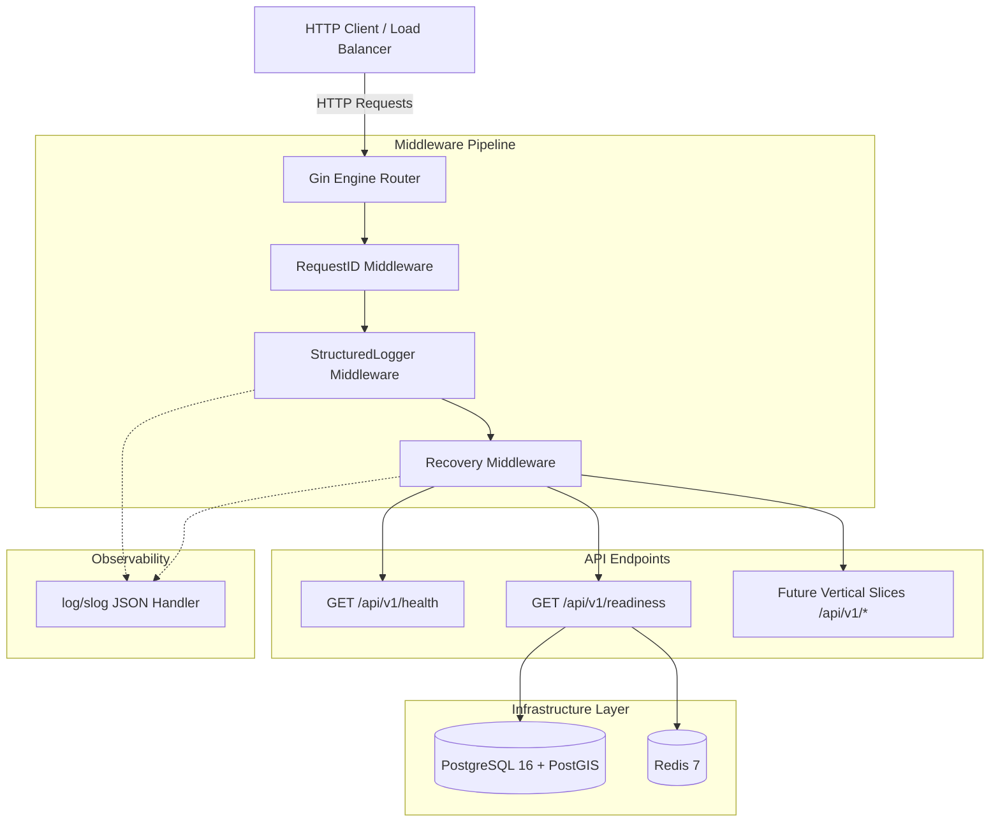

# LogiFlows Phase 0 Architecture: Engineering Foundation

## 1. Executive Summary
Phase 0 of **LogiFlows** establishes a production-grade, highly resilient backend foundation. Built around Go, Gin, PostgreSQL with PostGIS, and Redis, it provides standardized configurations, structured logging, request tracing, health probes, transactional migrations, and graceful lifecycle termination.

---

## 2. System Architecture Diagram



---

## 3. Directory Layout & Architectural Boundaries

```
LogiFlows/
├── backend/
│   ├── cmd/
│   │   └── api/                # Application entrypoint (main.go)
│   ├── internal/               # Private application code (Go internal package rules)
│   │   ├── config/             # Environment configuration & validation
│   │   ├── database/           # PostgreSQL connection pool & PostGIS verification
│   │   ├── health/             # Liveness & Readiness probe handlers
│   │   ├── logger/             # slog structured logger & context request ID
│   │   ├── middleware/         # HTTP request ID, logger, panic recovery
│   │   ├── redis/              # Redis client & ping health checks
│   │   ├── response/           # Uniform API response envelopes
│   │   └── server/             # Router setup & graceful HTTP server
│   ├── migrations/             # Goose SQL migrations & runner
│   ├── tests/
│   │   └── integration/        # Live Docker infrastructure integration tests
│   ├── Dockerfile              # Multi-stage production container definition
│   ├── go.mod                  # Go module definition
│   └── go.sum                  # Cryptographic dependency checksums
├── docs/                       # Comprehensive project documentation & ADRs
├── infrastructure/             # Deployment scripts & docker configurations
├── .github/workflows/          # CI pipeline automation
├── docker-compose.yml          # Local development infrastructure services
├── .env.example                # Canonical environment variable template
├── .gitignore                  # Git exclusion rules
├── Makefile                    # Developer automation targets
└── README.md                   # Project overview & onboarding guide
```

---

## 4. Request Lifecycle & Middleware Chain

Each incoming HTTP request passes through three foundational middlewares before reaching endpoint handlers:

1. **RequestID Middleware (`internal/middleware/request_id.go`)**:
   - Inspects `X-Request-ID` header.
   - If missing or blank, generates a new `UUIDv4`.
   - Attaches `request_id` to the Gin context, the response headers, and injects it into `context.Context` for downstream slog loggers.

2. **StructuredLogger Middleware (`internal/middleware/logger.go`)**:
   - Records request start time.
   - Yields execution to the next handler (`c.Next()`).
   - On completion, emits a structured log event with `http_method`, `path`, `status`, `latency_ms`, `client_ip`, and `request_id`.
   - Classifies log level dynamically: 5xx -> `ERROR`, 4xx -> `WARN`, 2xx/3xx -> `INFO`.

3. **Recovery Middleware (`internal/middleware/recovery.go`)**:
   - Catches unhandled runtime panics using Go's `recover()`.
   - Captures and logs the full stack trace to standard error without leaking details to clients.
   - Emits a standard `500 INTERNAL_SERVER_ERROR` JSON envelope with the associated `request_id`.

---

## 5. Persistence & Geospatial Foundation

### PostgreSQL 16 + PostGIS
- Managed via `github.com/jackc/pgx/v5/pgxpool` with configurable connection pool bounds (`MaxOpenConns`, `MaxIdleConns`, `ConnMaxLifetime`).
- Initial migration `00001_enable_extensions.sql` enables `postgis` and `uuid-ossp`.
- Geospatial readiness verified dynamically using `SELECT PostGIS_Full_Version()`.

### Redis 7
- Managed via `github.com/redis/go-redis/v9`.
- Connection validated via ping latency probes during readiness checks.
- Reserved for subsequent parcel tracking state cache, driver telemetry streams, and rate limiting.

---

## 6. Graceful Shutdown Design

When LogiFlows receives an OS termination signal (`SIGINT` or `SIGTERM`):
1. Signal channel unblocks in `main.go`.
2. A shutdown context with a 10-second deadline is created.
3. `http.Server.Shutdown(ctx)` is invoked, stopping new TCP accepts while allowing active in-flight requests to complete.
4. Database pool (`db.Close()`) and Redis connections (`cache.Close()`) are closed cleanly.
5. Process exits cleanly with exit code 0.
