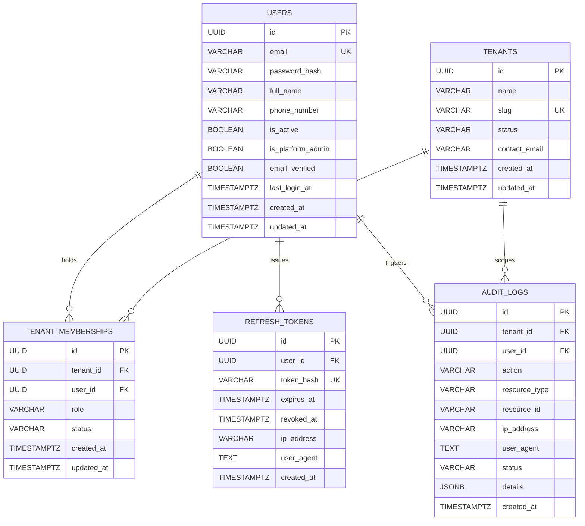

# LogiFlows Database Schema Specification — Phase 1: Identity & Multi-Tenancy

## 1. Overview
This document specifies the PostgreSQL 16 relational database schema established for **Phase 1: Identity, Multi-Tenancy, and Security Audit Foundation** in LogiFlows.

Geospatial extensions (`postgis`) and UUID generators (`uuid-ossp`) are enabled in migration `00001_enable_extensions.sql`. Core entities are partitioned across tables with strict foreign keys, cascaded referential actions, lowercased unique email indexes, and timezone-aware timestamps (`TIMESTAMPTZ`).

---

## 2. Entity Relationship Diagram (Mermaid)

---

## 3. Table Details

### 3.1 `users`
Stores user authentication identities across all tenant organizations.

| Column | Type | Constraints | Description |
| :--- | :--- | :--- | :--- |
| `id` | `UUID` | `PRIMARY KEY DEFAULT uuid_generate_v4()` | Unique user identifier |
| `email` | `VARCHAR(255)` | `NOT NULL` | User email address (normalized to lowercase) |
| `password_hash` | `VARCHAR(255)` | `NOT NULL` | Bcrypt password hash (cost 12) |
| `full_name` | `VARCHAR(255)` | `NOT NULL` | Full legal or display name |
| `phone_number` | `VARCHAR(50)` | `NULL` | Optional contact telephone number |
| `is_active` | `BOOLEAN` | `NOT NULL DEFAULT TRUE` | Active account status flag |
| `is_platform_admin` | `BOOLEAN` | `NOT NULL DEFAULT FALSE` | Global LogiFlows system administrator flag |
| `email_verified` | `BOOLEAN` | `NOT NULL DEFAULT FALSE` | Verification state of user's email |
| `last_login_at` | `TIMESTAMPTZ` | `NULL` | Timestamp of most recent successful login |
| `created_at` | `TIMESTAMPTZ` | `NOT NULL DEFAULT NOW()` | Record creation timestamp |
| `updated_at` | `TIMESTAMPTZ` | `NOT NULL DEFAULT NOW()` | Record last modification timestamp |

**Indexes**:
- `CREATE UNIQUE INDEX idx_users_email_lower ON users (LOWER(email));`
- `CREATE INDEX idx_users_is_active ON users (is_active);`

---

### 3.2 `refresh_tokens`
Stores cryptographically hashed refresh tokens for session lifecycle management and token rotation.

| Column | Type | Constraints | Description |
| :--- | :--- | :--- | :--- |
| `id` | `UUID` | `PRIMARY KEY DEFAULT uuid_generate_v4()` | Unique session identifier |
| `user_id` | `UUID` | `NOT NULL REFERENCES users(id) ON DELETE CASCADE` | Associated user identity |
| `token_hash` | `VARCHAR(64)` | `NOT NULL` | SHA-256 hexadecimal hash of opaque token |
| `expires_at` | `TIMESTAMPTZ` | `NOT NULL` | Refresh token expiration timestamp |
| `revoked_at` | `TIMESTAMPTZ` | `NULL` | Timestamp when revoked by logout or rotation |
| `ip_address` | `VARCHAR(45)` | `NULL` | Client IP address at token issuance |
| `user_agent` | `TEXT` | `NULL` | Client User-Agent header |
| `created_at` | `TIMESTAMPTZ` | `NOT NULL DEFAULT NOW()` | Record creation timestamp |

**Indexes**:
- `CREATE UNIQUE INDEX idx_refresh_tokens_hash ON refresh_tokens (token_hash);`
- `CREATE INDEX idx_refresh_tokens_user_expires ON refresh_tokens (user_id, expires_at);`
- `CREATE INDEX idx_refresh_tokens_user_revoked ON refresh_tokens (user_id, revoked_at);`

---

### 3.3 `tenants`
Represents isolated company organizations integrating with LogiFlows.

| Column | Type | Constraints | Description |
| :--- | :--- | :--- | :--- |
| `id` | `UUID` | `PRIMARY KEY DEFAULT uuid_generate_v4()` | Unique tenant identifier |
| `name` | `VARCHAR(255)` | `NOT NULL` | Legal or operating business name |
| `slug` | `VARCHAR(100)` | `NOT NULL` | URL-safe unique company slug |
| `status` | `VARCHAR(50)` | `NOT NULL DEFAULT 'ACTIVE' CHECK (status IN ('ACTIVE', 'SUSPENDED', 'DEACTIVATED'))` | Tenant operating lifecycle state |
| `contact_email` | `VARCHAR(255)` | `NOT NULL` | Primary corporate contact email |
| `created_at` | `TIMESTAMPTZ` | `NOT NULL DEFAULT NOW()` | Record creation timestamp |
| `updated_at` | `TIMESTAMPTZ` | `NOT NULL DEFAULT NOW()` | Record last modification timestamp |

**Indexes**:
- `CREATE UNIQUE INDEX idx_tenants_slug ON tenants (slug);`
- `CREATE INDEX idx_tenants_status ON tenants (status);`

---

### 3.4 `tenant_memberships`
Maps users to tenants with Role-Based Access Control (RBAC).

| Column | Type | Constraints | Description |
| :--- | :--- | :--- | :--- |
| `id` | `UUID` | `PRIMARY KEY DEFAULT uuid_generate_v4()` | Unique membership record identifier |
| `tenant_id` | `UUID` | `NOT NULL REFERENCES tenants(id) ON DELETE CASCADE` | Associated tenant |
| `user_id` | `UUID` | `NOT NULL REFERENCES users(id) ON DELETE CASCADE` | Associated user |
| `role` | `VARCHAR(50)` | `NOT NULL CHECK (role IN ('PLATFORM_ADMIN', 'TENANT_ADMIN', 'TENANT_OPERATOR', 'VIEWER'))` | Assigned RBAC role |
| `status` | `VARCHAR(50)` | `NOT NULL DEFAULT 'ACTIVE' CHECK (status IN ('ACTIVE', 'INVITED', 'DEACTIVATED'))` | Membership status |
| `created_at` | `TIMESTAMPTZ` | `NOT NULL DEFAULT NOW()` | Record creation timestamp |
| `updated_at` | `TIMESTAMPTZ` | `NOT NULL DEFAULT NOW()` | Record last modification timestamp |

**Constraints & Indexes**:
- `CONSTRAINT uq_tenant_user UNIQUE (tenant_id, user_id)`
- `CREATE INDEX idx_memberships_user_id ON tenant_memberships (user_id);`
- `CREATE INDEX idx_memberships_tenant_id ON tenant_memberships (tenant_id);`
- `CREATE INDEX idx_memberships_tenant_role ON tenant_memberships (tenant_id, role);`

---

### 3.5 `audit_logs`
Immutable security event and operational audit trail.

| Column | Type | Constraints | Description |
| :--- | :--- | :--- | :--- |
| `id` | `UUID` | `PRIMARY KEY DEFAULT uuid_generate_v4()` | Unique audit record identifier |
| `tenant_id` | `UUID` | `REFERENCES tenants(id) ON DELETE SET NULL` | Scoped tenant ID (nullable) |
| `user_id` | `UUID` | `REFERENCES users(id) ON DELETE SET NULL` | Actor user ID (nullable) |
| `action` | `VARCHAR(100)` | `NOT NULL` | Audit action code (e.g. `USER_REGISTERED`, `USER_LOGIN`) |
| `resource_type` | `VARCHAR(100)` | `NOT NULL` | Target resource domain |
| `resource_id` | `VARCHAR(255)` | `NULL` | ID or key of affected entity |
| `ip_address` | `VARCHAR(45)` | `NULL` | Client IP address |
| `user_agent` | `TEXT` | `NULL` | Client User-Agent string |
| `status` | `VARCHAR(50)` | `NOT NULL` | Outcome state (`SUCCESS`, `FAILURE`) |
| `details` | `JSONB` | `NOT NULL DEFAULT '{}'::jsonb` | Contextual JSON payload without secrets |
| `created_at` | `TIMESTAMPTZ` | `NOT NULL DEFAULT NOW()` | Event recording timestamp |

**Indexes**:
- `CREATE INDEX idx_audit_logs_tenant_created ON audit_logs (tenant_id, created_at DESC);`
- `CREATE INDEX idx_audit_logs_user_created ON audit_logs (user_id, created_at DESC);`
- `CREATE INDEX idx_audit_logs_action ON audit_logs (action);`

---

## 4. Migrations History & Rollback Strategy

### 4.1 Migration Versions
1. `00001_enable_extensions.sql`: Enables `uuid-ossp` and `postgis`.
2. `00002_create_identity_and_tenancy.sql`: Establishes `users`, `tenants`, `tenant_memberships`, and `audit_logs`.
3. `00003_add_refresh_tokens_and_user_verification.sql`: Adds `email_verified` column to `users` and creates `refresh_tokens` table with cryptographic index constraints.

### 4.2 Rollback Strategy
Every migration contains an idempotent `-- +goose Down` block.
- Migration 3 rollback drops `refresh_tokens` and removes `email_verified` from `users`.
- Migration 2 rollback drops `audit_logs`, `tenant_memberships`, `tenants`, and `users` in reverse dependency order.
- Migration 1 rollback drops extensions if no dependent relations exist.

Automated rollback execution is validated via Go integration tests (`TestMigrations_RollbackAndReapply` in `backend/tests/integration/migration_test.go`), which verifies database state across down/up cycles.

