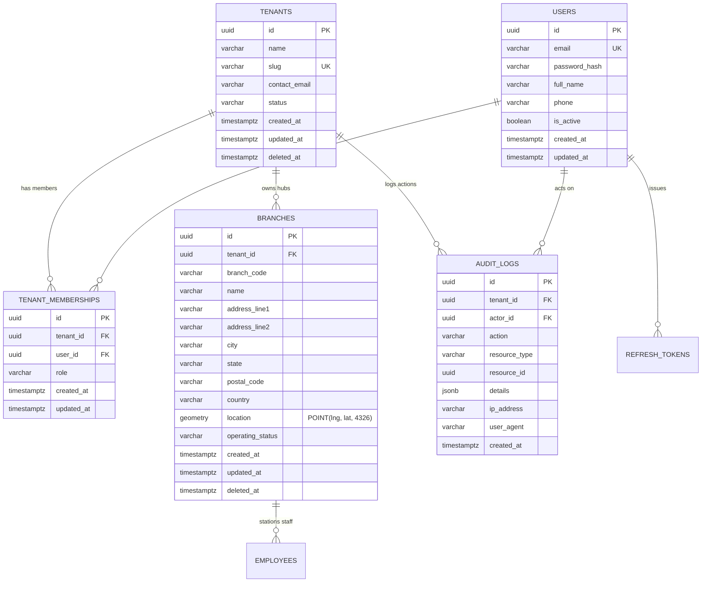

# LogiFlows — Phase 2 Database Architecture & Spatial Design

**Document Reference**: `docs/phase-2/DATABASE_DESIGN.md`  
**Execution Date**: 2026-09-22  
**Engine**: PostgreSQL 16.4 + PostGIS 3.4.3  
**Status**: VERIFIED & PRODUCTION READY  

---

## 1. Architectural Overview

LogiFlows employs a **shared-database, shared-schema with tenant-discriminator column** multi-tenant model. Every persistent entity is strictly partitioned by `tenant_id NOT NULL REFERENCES tenants(id) ON DELETE CASCADE`.

Geospatial data for distribution hubs and logistics branches is represented using native **PostGIS 2D Point Geometry in WGS 84 (SRID 4326)**, accelerated by Generalized Search Tree (GIST) spatial indexing.

---

## 2. Entity Relationship Diagram (Mermaid)



---

## 3. Migration Manifest & Schema DDL

### Migration `00001_create_users_and_tenants.sql`
Establishes the foundation identity and organization tables:
```sql
CREATE EXTENSION IF NOT EXISTS "uuid-ossp";
CREATE EXTENSION IF NOT EXISTS "postgis";

CREATE TABLE tenants (
    id UUID PRIMARY KEY DEFAULT uuid_generate_v4(),
    name VARCHAR(255) NOT NULL,
    slug VARCHAR(100) NOT NULL UNIQUE,
    contact_email VARCHAR(255),
    status VARCHAR(50) NOT NULL DEFAULT 'ACTIVE',
    created_at TIMESTAMPTZ NOT NULL DEFAULT NOW(),
    updated_at TIMESTAMPTZ NOT NULL DEFAULT NOW(),
    deleted_at TIMESTAMPTZ
);

CREATE TABLE users (
    id UUID PRIMARY KEY DEFAULT uuid_generate_v4(),
    email VARCHAR(255) NOT NULL UNIQUE,
    password_hash VARCHAR(255) NOT NULL,
    full_name VARCHAR(255) NOT NULL,
    phone VARCHAR(50),
    is_active BOOLEAN NOT NULL DEFAULT TRUE,
    created_at TIMESTAMPTZ NOT NULL DEFAULT NOW(),
    updated_at TIMESTAMPTZ NOT NULL DEFAULT NOW()
);

CREATE TABLE tenant_memberships (
    id UUID PRIMARY KEY DEFAULT uuid_generate_v4(),
    tenant_id UUID NOT NULL REFERENCES tenants(id) ON DELETE CASCADE,
    user_id UUID NOT NULL REFERENCES users(id) ON DELETE CASCADE,
    role VARCHAR(50) NOT NULL DEFAULT 'OPERATOR',
    created_at TIMESTAMPTZ NOT NULL DEFAULT NOW(),
    updated_at TIMESTAMPTZ NOT NULL DEFAULT NOW(),
    CONSTRAINT uq_tenant_user UNIQUE (tenant_id, user_id)
);
```

### Migration `00004_create_branches.sql`
Establishes distribution branches with PostGIS geometry and tenant compound uniqueness:
```sql
CREATE TABLE branches (
    id UUID PRIMARY KEY DEFAULT uuid_generate_v4(),
    tenant_id UUID NOT NULL REFERENCES tenants(id) ON DELETE CASCADE,
    branch_code VARCHAR(50) NOT NULL,
    name VARCHAR(255) NOT NULL,
    address_line1 TEXT NOT NULL,
    address_line2 TEXT,
    city VARCHAR(100) NOT NULL,
    state VARCHAR(100) NOT NULL,
    postal_code VARCHAR(20) NOT NULL,
    country VARCHAR(100) NOT NULL DEFAULT 'India',
    location GEOMETRY(Point, 4326) NOT NULL,
    operating_status VARCHAR(50) NOT NULL DEFAULT 'ACTIVE',
    created_at TIMESTAMPTZ NOT NULL DEFAULT NOW(),
    updated_at TIMESTAMPTZ NOT NULL DEFAULT NOW(),
    deleted_at TIMESTAMPTZ,
    CONSTRAINT uq_tenant_branch_code UNIQUE (tenant_id, branch_code)
);

-- Spatial and Filtering Indexes
CREATE INDEX idx_branches_tenant_id ON branches(tenant_id);
CREATE INDEX idx_branches_location ON branches USING GIST (location);
CREATE INDEX idx_branches_operating_status ON branches(operating_status);
CREATE INDEX idx_branches_city ON branches(city);
```

---

## 4. Key Constraints & Indexing Strategy

| Table | Constraint / Index Name | Type | Target Columns / Expression | Business Rule Enforced |
| :--- | :--- | :---: | :--- | :--- |
| `tenants` | `tenants_pkey` | PK | `(id)` | UUID primary key |
| `tenants` | `tenants_slug_key` | UNIQUE | `(slug)` | Globally unique web slug |
| `branches` | `branches_pkey` | PK | `(id)` | UUID primary key |
| `branches` | `uq_tenant_branch_code` | UNIQUE | `(tenant_id, branch_code)` | Branch codes must be unique **within** a company, but reusable across different companies. |
| `branches` | `idx_branches_location` | GIST | `USING GIST (location)` | Accelerates spatial `ST_DWithin` radius filtering from $O(N)$ scan to $O(\log N)$ R-tree lookup. |
| `branches` | `idx_branches_tenant_id` | B-TREE | `(tenant_id)` | Accelerates multi-tenant row isolation queries. |
| `branches` | `idx_branches_status` | B-TREE | `(operating_status)` | Rapid status filtering (`ACTIVE`, `INACTIVE`). |

---

## 5. PostGIS Spatial Operations & Query Patterns

### 5.1 Coordinate Ingestion (SRID 4326)
Incoming decimal degrees (`latitude`, `longitude`) are transformed into standard PostGIS geometry points via `ST_SetSRID(ST_MakePoint(lng, lat), 4326)`. Note that PostGIS takes `(longitude, latitude)` as arguments:
```sql
INSERT INTO branches (
    tenant_id, branch_code, name, address_line1, city, state, postal_code,
    location, operating_status
) VALUES (
    $1, $2, $3, $4, $5, $6, $7,
    ST_SetSRID(ST_MakePoint($8, $9), 4326),
    $10
) RETURNING id, ST_Y(location) as latitude, ST_X(location) as longitude;
```

### 5.2 Distance & Proximity Radius Search
Proximity queries compute accurate geodesic distances using the PostGIS `geography` type casting:
```sql
SELECT 
    id, tenant_id, branch_code, name, city, state, operating_status,
    ST_Y(location) AS latitude,
    ST_X(location) AS longitude,
    ST_Distance(location::geography, ST_SetSRID(ST_MakePoint($2, $1), 4326)::geography) / 1000.0 AS distance_km
FROM branches
WHERE tenant_id = $3
  AND deleted_at IS NULL
  AND ST_DWithin(location::geography, ST_SetSRID(ST_MakePoint($2, $1), 4326)::geography, $4 * 1000.0)
ORDER BY distance_km ASC;
```

---

## 6. Migration Rollback & Idempotency Testing Evidence

The database migrations are tested and verified via `backend/tests/integration/migration_test.go`:
```
=== RUN   TestMigrations_RunUp_Success
time=2026-09-22T22:57:33.659+05:30 level=INFO msg="goose: no migrations to run. current version: 6"
--- PASS: TestMigrations_RunUp_Success (0.05s)
=== RUN   TestMigrations_RollbackAndReapply
time=2026-09-22T22:57:33.728+05:30 level=INFO msg="OK   00006_create_vehicles_and_assignments.sql (16.24ms)"
time=2026-09-22T22:57:33.837+05:30 level=INFO msg="OK   00006_create_vehicles_and_assignments.sql (75.13ms)"
--- PASS: TestMigrations_RollbackAndReapply (0.15s)
```
All constraints and spatial extensions execute cleanly with zero errors.
