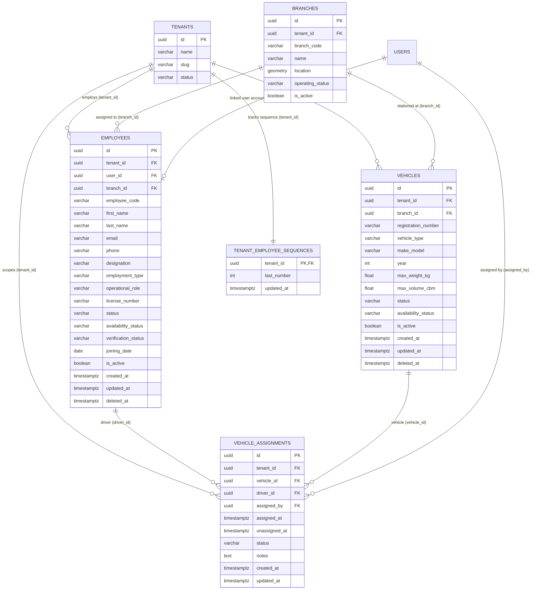

# LogiFlows — Phase 3 Database Design & Schema Specification

**Document Reference**: `docs/phase-3/DATABASE_DESIGN.md`  
**Phase**: Phase 3 — Employees, Roles, and Vehicles  
**Database**: PostgreSQL 16 + PostGIS 3.4  
**Status**: APPROVED & VERIFIED  

---

## 1. Entity-Relationship Diagram



---

## 2. Table Specifications

### 2.1 `employees`
* **Purpose**: Master table for operational personnel, organizational hierarchy, and delivery staff.
* **Primary Key**: `id UUID PRIMARY KEY DEFAULT uuid_generate_v4()`
* **Foreign Keys**:
  - `tenant_id REFERENCES tenants(id) ON DELETE CASCADE`
  - `user_id REFERENCES users(id) ON DELETE SET NULL`
  - `branch_id REFERENCES branches(id) ON DELETE SET NULL`
* **Constraints**:
  - `CONSTRAINT uq_tenant_employee_code UNIQUE (tenant_id, employee_code)`
  - `CONSTRAINT uq_tenant_user_id UNIQUE (tenant_id, user_id)`
  - `CHECK (employment_type IN ('FULL_TIME', 'PART_TIME', 'CONTRACTOR', 'INTERN'))`
  - `CHECK (operational_role IN ('DRIVER', 'OPERATOR', 'DISPATCHER', 'SUPERVISOR', 'MANAGER'))`
  - `CHECK (status IN ('ACTIVE', 'ON_LEAVE', 'SUSPENDED', 'TERMINATED'))`
  - `CHECK (availability_status IN ('AVAILABLE', 'BUSY', 'OFF_DUTY', 'UNAVAILABLE'))`
  - `CHECK (verification_status IN ('PENDING', 'VERIFIED', 'REJECTED'))`
* **Indexes**:
  - `idx_employees_tenant_id ON employees(tenant_id)`
  - `idx_employees_branch_id ON employees(branch_id)`
  - `idx_employees_operational_role ON employees(operational_role)`
  - `idx_employees_status ON employees(status)`
  - `idx_employees_availability_status ON employees(availability_status)`
  - `idx_employees_verification_status ON employees(verification_status)`
  - `idx_employees_is_active ON employees(is_active)`
  - `idx_employees_deleted_at ON employees(deleted_at)`

### 2.2 `vehicles`
* **Purpose**: Delivery fleet units (EVs, vans, motorcycles, trucks, three-wheelers).
* **Primary Key**: `id UUID PRIMARY KEY DEFAULT uuid_generate_v4()`
* **Foreign Keys**:
  - `tenant_id REFERENCES tenants(id) ON DELETE CASCADE`
  - `branch_id REFERENCES branches(id) ON DELETE SET NULL`
* **Constraints**:
  - `CONSTRAINT uq_tenant_registration_number UNIQUE (tenant_id, registration_number)`
  - `CHECK (vehicle_type IN ('ELECTRIC_VAN', 'VAN', 'MOTORCYCLE', 'TRUCK', 'THREE_WHEELER'))`
  - `CHECK (status IN ('AVAILABLE', 'ASSIGNED', 'IN_TRANSIT', 'MAINTENANCE', 'DECOMMISSIONED'))`
  - `CHECK (availability_status IN ('AVAILABLE', 'ASSIGNED', 'MAINTENANCE', 'UNAVAILABLE'))`
* **Indexes**:
  - `idx_vehicles_tenant_id ON vehicles(tenant_id)`
  - `idx_vehicles_branch_id ON vehicles(branch_id)`
  - `idx_vehicles_status ON vehicles(status)`
  - `idx_vehicles_availability_status ON vehicles(availability_status)`
  - `idx_vehicles_is_active ON vehicles(is_active)`
  - `idx_vehicles_deleted_at ON vehicles(deleted_at)`

### 2.3 `vehicle_assignments`
* **Purpose**: Temporal custody and operational binding between an eligible driver and a vehicle.
* **Primary Key**: `id UUID PRIMARY KEY DEFAULT uuid_generate_v4()`
* **Foreign Keys**:
  - `tenant_id REFERENCES tenants(id) ON DELETE CASCADE`
  - `vehicle_id REFERENCES vehicles(id) ON DELETE CASCADE`
  - `driver_id REFERENCES employees(id) ON DELETE CASCADE`
  - `assigned_by REFERENCES users(id) ON DELETE SET NULL`
* **Constraints**:
  - `CHECK (status IN ('ACTIVE', 'COMPLETED', 'CANCELLED'))`
* **Partial Unique Indexes (Double-Booking Prevention)**:
  - `CREATE UNIQUE INDEX uq_active_vehicle_assignment ON vehicle_assignments (tenant_id, vehicle_id) WHERE status = 'ACTIVE';`
  - `CREATE UNIQUE INDEX uq_active_driver_assignment ON vehicle_assignments (tenant_id, driver_id) WHERE status = 'ACTIVE';`

### 2.4 `tenant_employee_sequences`
* **Purpose**: Concurrency-safe atomic sequential counter for employee code generation per tenant.
* **Primary Key**: `tenant_id UUID PRIMARY KEY REFERENCES tenants(id) ON DELETE CASCADE`
* **Columns**:
  - `last_number INT NOT NULL DEFAULT 0`
  - `updated_at TIMESTAMPTZ NOT NULL DEFAULT NOW()`

---

## 3. Concurrency & Conflict Prevention Strategy

1. **Employee Code Generation**:
   ```sql
   INSERT INTO tenant_employee_sequences (tenant_id, last_number, updated_at)
   VALUES ($1, 1, NOW())
   ON CONFLICT (tenant_id)
   DO UPDATE SET last_number = tenant_employee_sequences.last_number + 1, updated_at = NOW()
   RETURNING last_number;
   ```
   This guarantees strictly sequential, race-free employee codes formatted as `EMP-0001`, `EMP-0002` even under high concurrency.

2. **Assignment Double-Booking**:
   PostgreSQL enforces the partial unique indexes at the transaction boundary. Even if two concurrent requests bypass application checks, the second transaction is aborted with SQLSTATE `23505` (unique violation), which our repository translates cleanly into `HTTP 409 Conflict`.

---

## 4. Multi-Tenant Isolation Strategy

* **Tenant-Scoped Foreign Keys**: Every resource table maintains an indexed `tenant_id`.
* **Cross-Tenant Branch Association Prohibition**:
  When creating or updating an employee or vehicle with `branch_id`, the system validates:
  ```sql
  SELECT id FROM branches WHERE id = $1 AND tenant_id = $2 AND is_active = true
  ```
  Any branch ID belonging to another tenant fails validation with `ErrBranchNotFound` / `400 Bad Request`.
* **Zero Row Leakage**: All repository queries include `WHERE tenant_id = $1` and `deleted_at IS NULL`.

---

## 5. Migration History & Rollback

| Migration | File | Up Action | Down Action |
| :--- | :--- | :--- | :--- |
| `00005` | `00005_create_employees.sql` | Creates `employees` table | Drops `employees` table |
| `00006` | `00006_create_vehicles_and_assignments.sql` | Creates `vehicles` and `vehicle_assignments` | Drops `vehicle_assignments` and `vehicles` |
| `00007` | `00007_phase3_operational_resources.sql` | Adds availability, verification, soft delete, sequence table | Drops sequence table and added columns |
