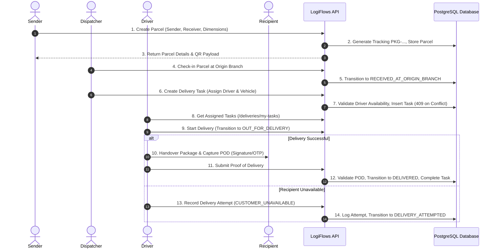

# LogiFlows Delivery Workflow & Branch Custody

## 1. End-to-End Operational Lifecycle

The LogiFlows delivery workflow spans four distinct operational stages:
1. **Intake & Sorting (Hub Operations)**
2. **Inter-Branch Linehaul (Transfer)**
3. **Last-Mile Dispatch (Delivery Task)**
4. **Proof of Delivery & Handover (POD)**

---

## 2. Concurrency Conflict Prevention
- **Race Condition Scenario:** Two dispatchers simultaneously assign the same parcel to two different drivers.
- **Resolution Strategy:**
  1. Transactional isolation with check on parcel eligibility.
  2. Database-level partial unique index:
     `CREATE UNIQUE INDEX idx_active_parcel_delivery_task ON delivery_tasks (tenant_id, parcel_id) WHERE status IN ('ASSIGNED', 'IN_PROGRESS');`
  3. When duplicate assignment occurs, PostgreSQL throws error `23505 (unique_violation)`.
  4. Repository maps this directly to `ErrParcelAlreadyAssigned`, returning `HTTP 409 Conflict`.

---

## 3. Branch Transfer & Custody Invariants
- A transfer can only be created between two distinct branches of the same tenant.
- A parcel cannot be associated with multiple active transfers simultaneously.
- When a destination branch operator scans a parcel during receiving:
  - If the parcel is marked on the manifest, its `current_branch_id` is updated to the destination branch.
  - Its status transitions from `IN_TRANSIT` to `RECEIVED_AT_TRANSFER_BRANCH`.
  - Re-scanning an already received parcel returns an idempotent success confirmation, preventing duplicate receipt logging.
