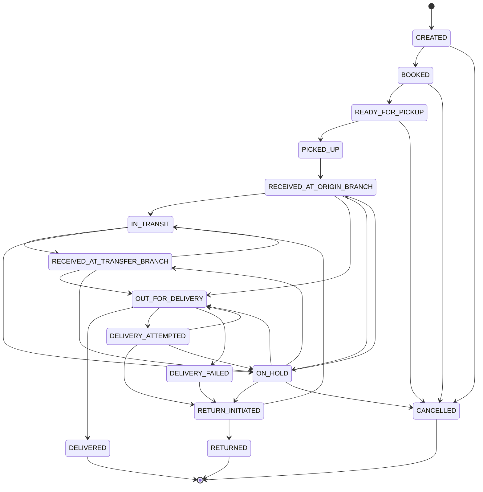

# LogiFlows Parcel Status State Machine

## 1. Overview
The parcel lifecycle in LogiFlows is governed by a strict deterministic finite state machine (FSM). Arbitrary status jumps are rejected to guarantee data integrity, accurate custody tracking, and auditable billing.

---

## 2. Valid States & Descriptions

| State | Scope | Description |
|---|---|---|
| `CREATED` | Intake | Package draft registered by merchant or operator. |
| `BOOKED` | Logistics | Order confirmed, pickup scheduled. |
| `READY_FOR_PICKUP` | First-Mile | Awaiting pickup by driver at sender location. |
| `PICKED_UP` | First-Mile | Package picked up by courier from sender. |
| `RECEIVED_AT_ORIGIN_BRANCH` | Hub Custody | Received and scanned into the sender's origin distribution hub. |
| `IN_TRANSIT` | Linehaul | Traveling between hubs or in freight transit. |
| `RECEIVED_AT_TRANSFER_BRANCH` | Hub Custody | Scanned into destination or intermediate sorting branch. |
| `OUT_FOR_DELIVERY` | Last-Mile | Dispatched in delivery vehicle for recipient dropoff. |
| `DELIVERY_ATTEMPTED` | Last-Mile | Driver attempted delivery but recipient was unavailable or unreachable. |
| `DELIVERED` | Terminal | Completed delivery backed by validated Proof of Delivery (POD). |
| `DELIVERY_FAILED` | Terminal | Terminal failed delivery after exhausting attempts. |
| `RETURN_INITIATED` | Reverse | Package flagged for return to origin hub or merchant. |
| `RETURNED` | Terminal | Package safely checked back into origin branch or returned to sender. |
| `CANCELLED` | Terminal | Order cancelled by merchant/admin before dispatch. |
| `ON_HOLD` | Exception | Temporarily paused for address clarification, security, or payment. |

---

## 3. Allowed Transition Matrix



---

## 4. Role Authorization Rules for State Transitions

- **Admin / Operator Roles (`TENANT_ADMIN`, `TENANT_OPERATOR`):**
  - Can trigger: `CREATED -> BOOKED`, `BOOKED -> READY_FOR_PICKUP`, `CANCELLED`, `ON_HOLD`, `RETURN_INITIATED`.
  - Can initiate inter-branch transfers and mark branch intake (`RECEIVED_AT_ORIGIN_BRANCH`, `RECEIVED_AT_TRANSFER_BRANCH`).
- **Driver / Courier Roles (`DRIVER`, `DELIVERY_EXECUTIVE`, `EMPLOYEE`):**
  - Can trigger: `READY_FOR_PICKUP -> PICKED_UP`.
  - Can trigger: `OUT_FOR_DELIVERY -> DELIVERED` (Requires valid Proof of Delivery payload).
  - Can trigger: `OUT_FOR_DELIVERY -> DELIVERY_ATTEMPTED` (Requires attempt reason).
- **Automated Validation:**
  - If a parcel transition does not match the valid source-target pairs defined above, the backend rejects it with:
    ```json
    {
      "error": {
        "code": "INVALID_STATE_TRANSITION",
        "message": "Cannot transition parcel from CURRENT_STATE to DESIRED_STATE"
      }
    }
    ```
